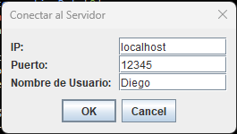

# (Documentación) Práctica TCP Hundir la Flota

**Centro Educativo Salesianos “Las Naves”  
Programación de Servicios y Procesos  
2º Grado Superior en DAM**

- Diego Hernández
- Francisco Hernández
- Peter Perez
- Antonio MBA

**Repositorio del juego en GitHub:**  
[https://github.com/Kabash87/Naves-Battleship](https://github.com/Kabash87/Naves-Battleship)

---

## Índice

- [Introducción](#introducción)
- [Inicio del Juego](#inicio-del-juego)
- [Inicio Servidor](#inicio-servidor)
- [Inicio Clientes](#inicio-clientes)
- [Apariencia del tablero una vez registrado](#apariencia-del-tablero-una-vez-registrado)
- [Partida en curso – Tableros 2 jugadores](#partida-en-curso---tableros-2-jugadores)
- [Pantallazo tablero jugador Fran (Servidor)](#pantallazo-tablero-jugador-fran-servidor)
- [Pantallazo tablero jugador Diego (Servidor)](#pantallazo-tablero-jugador-diego-servidor)
- [Pruebas con varios jugadores (Modo Battle Royale)](#pruebas-con-varios-jugadores-modo-battle-royale)
- [Modo Oscuro – Interfaz](#modo-oscuro---interfaz)
- [Derrota de un Jugador / Mensaje de Victoria](#derrota-de-un-jugador--mensaje-de-victoria)
- [Estructura del Proyecto](#estructura-del-proyecto)
- [Compilación y Ejecución](#compilación-y-ejecución)

---

## Introducción

El proyecto consiste en la simulación del juego clásico **"Hundir la Flota" (Battleship)** utilizando el protocolo TCP y el lenguaje de programación Java. El juego se compone de un servidor central y varios clientes que actúan como jugadores. El objetivo es que los jugadores adivinen la ubicación de los barcos enemigos en un tablero de juego.

Cuando el servidor recibe un tiro de un cliente, deberá consultar si ha acertado y enviar uno de los siguientes mensajes:

- `#AGUA#` → si no hay acierto.
- `#TOCADO#` → si ha acertado, pero no ha hundido el barco.
- `#HUNDIDO#` → si el barco se ha hundido completamente.

El juego finaliza cuando un jugador logra hundir todos los barcos del oponente.

El programa tiene dos modos de juego:

1. **2 jugadores:** Se utiliza un tablero con una cuadrícula de 10x10.
2. **Modo Battle Royale:** Varios jugadores se conectan al servidor y juegan entre todos eliminando los barcos enemigos hasta que quede solo un jugador (en principio, con un límite de 5 jugadores).

---

## Inicio del Juego

Para iniciar la partida, es necesario arrancar primero el servidor y luego los clientes.

- **Servidor:**
    - **Archivo:** `ServerMain`
    - **Ubicación:** `bin/ServerMain`
    - **Código fuente:** `src/server/ServerMain.java`

- **Cliente:**
    - **Archivo:** `ClientMain`
    - **Ubicación:** `bin/ClientMain`
    - **Código fuente:** `src/client/ClientMain.java`

---

## Inicio Servidor


---

## Inicio Clientes

Al iniciar el cliente, se debe realizar el registro del jugador.  



---

## Apariencia del tablero una vez registrado


Visualización del registro de dos clientes (por ejemplo, Diego y Fran).  
Una vez iniciado el juego, cada jugador tendrá un turno para jugar; si transcurren 30 segundos sin acción, el jugador pierde su turno.

---

## Partida en curso – Tableros 2 jugadores


El servidor muestra los tableros de los jugadores en tiempo real, alternando según el turno de cada uno.

---

## Pantallazo tablero jugador Fran (Servidor)


*Imagen del tablero del jugador Fran en la interfaz del servidor.*

---

## Pantallazo tablero jugador Diego (Servidor)


*Imagen del tablero del jugador Diego en la interfaz del servidor.*

---

## Pruebas con varios jugadores (Modo Battle Royale)

En la interfaz del servidor se pueden observar las tablas descubiertas de todos los jugadores y su estado actual. Aunque la interfaz es similar a la de los clientes, esta no puede intervenir en la partida, sino que únicamente muestra el estado en tiempo real.
*Pantallazo mostrando una partida en curso con varios jugadores.*


---

## Modo Oscuro – Interfaz

Dentro de la interfaz del cliente es posible habilitar el **modo oscuro**.


*Pantallazo del modo oscuro activado.*

---

## Derrota de un Jugador / Mensaje de Victoria

Al finalizar una partida, se mostrará el mensaje de “¡Victoria!” en la interfaz del jugador que haya logrado hundir todos los barcos enemigos, mientras que los demás verán el mensaje “Derrota”. En este punto, la partida se bloqueará y no se podrán realizar más movimientos. Para iniciar una nueva partida, es necesario reiniciar el programa.


*Pantallazo del fin de partida.*

---

## Estructura del Proyecto

La estructura del proyecto es la siguiente:

```
src/
├── client
│   ├── Client.java
│   ├── ClientListener.java
│   ├── ClientMain.java
│   └── ClientReaderThread.java
├── gui
│   ├── DefeatAnimation.java
│   ├── GUIMain.java
│   ├── GUIServer.java
│   └── VictoryAnimation.java
├── resources
│   ├── agua.png
│   ├── Protocol.java
│   ├── music.wav
│   ├── tocado.png
│   └── tubarco.png
└── server
    ├── Board.java
    ├── BufferedReaderWrapper.java
    ├── ClientHandler.java
    ├── Coordinate.java
    ├── GameServer.java
    ├── Player.java
    ├── PrintWriterWrapper.java
    ├── ServerMain.java
    ├── Ship.java
    ├── ShotResult.java
    └── ShotResultType.java
```

---

## Compilación y Ejecución

Para compilar y ejecutar el proyecto, sigue estos pasos desde la carpeta raíz del proyecto:

### 1. Generar la lista de archivos Java

- **Windows 10/11 (Powershell):**
  ```powershell
  Get-ChildItem -Path src -Recurse -Filter *.java | ForEach-Object { $_.FullName } > sources.txt
  ```

- **Linux Ubuntu:**
  ```bash
  find src -type f -name "*.java" > sources.txt
  ```

### 2. Compilar los archivos Java y generar los archivos `.class` en la carpeta `bin/`

- **Windows 10/11 (Powershell):**
  ```powershell
  javac -d bin $(Get-Content sources.txt)
  ```

- **Linux Ubuntu:**
  ```bash
  javac -d bin $(cat sources.txt)
  ```

### 3. Ejecutar el servidor
```bash
java -cp bin server.ServerMain
```

### 4. Ejecutar el cliente
```bash
java -cp bin client.ClientMain
```
